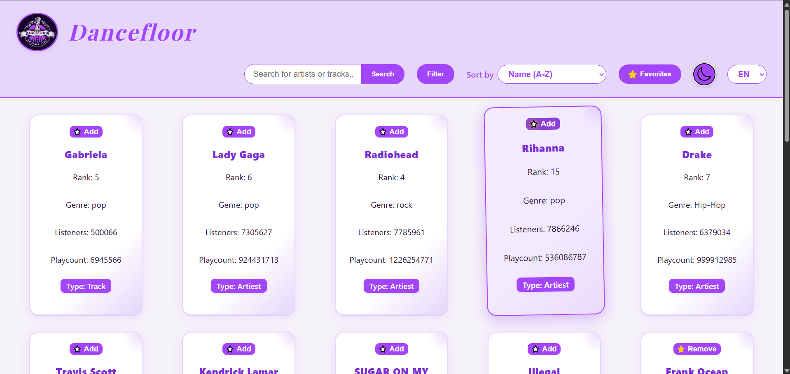
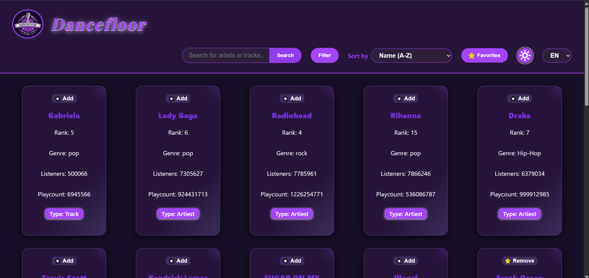
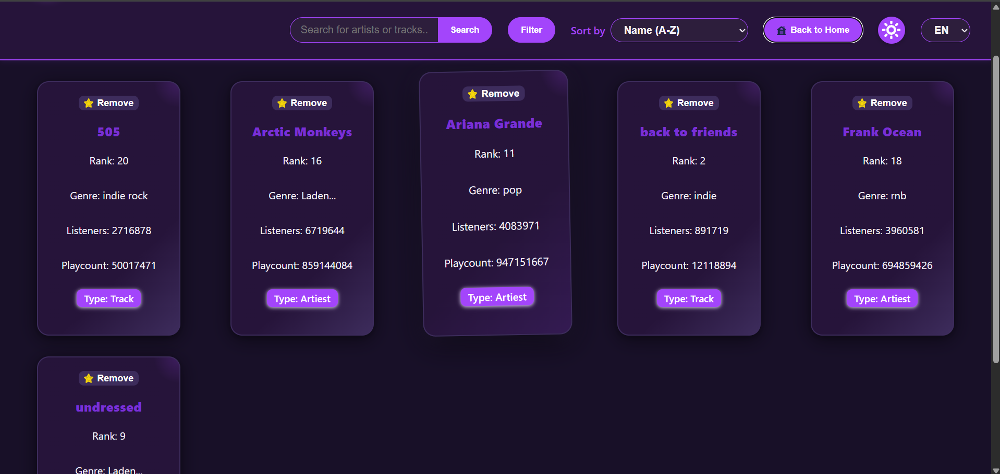
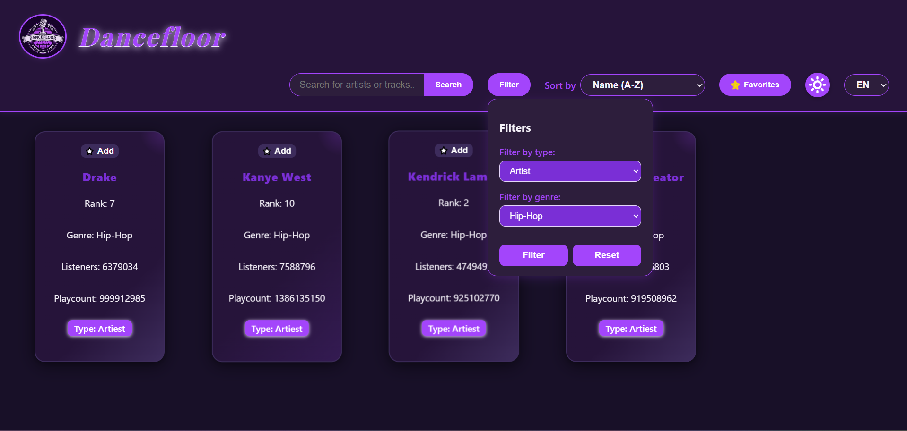

# Project: Dancefloor 💃
## Projectbeschrijving 📝

Voor het vak Web Advanced werd deze single-page webapplicatie project gemaakt. Deze app gebruikt de [Last.fm API](https://www.last.fm/api)
om tracks en artiesten aan te bieden aan zijn gebruikers. Deze applicatie bevat een aantal functies die de gebruikers helpen in zijn zoektocht naar nieuwe liedjes of artiesten. Deze functies worden hieronder verder besproken.

## Functionaliteiten 📑

* Dataverzameling & weergave
  * API: [Last.fm API](https://www.last.fm/api)
  * 📦 items met 6 details:
    * Naam
    * Rang
    * Genre
    * Luisteraars
    * Speelteller
    * Type
  * 📸 logo image from [this website](https://www.design.com/maker/logos/page1?text=Dancefloor&isFromLogoHome=true#show-onboarding-modal)
* Interactiviteit
  * Filteren op basis van type of genre
  * 🗂️ Sorteer op naam, rang, aantal luisteraars en speelteller
  * 🔎 Zoeken naar item-naam
* Personalisatie
  * ✨ Favoriete tracks of artiesten opslaan (bewaard in `localStorage`)
  * 🌕 Licht en donkere modus (ook in `localStorage`)
  * 🌎 Taalkeuze: Nederlands of Engels (ook opgeslagen in `localStorage`)
* Gebruikerservaring
  * 🎨 Responsive design
  * Visueel aantrekkelijke interface
  * 🤗 Gebruiksvriendelijke navigatie


## 🌐 Gebruikte API

**Last.fm API** – [muziek-API](https://www.last.fm/api)
- Endpoint:  
  `https://ws.audioscrobbler.com/2.0/`


## 💻 Technische vereisten

1. DOM Manipulatie

* Elementen selecteren: regel 11 `const filterContainer = document.getElementById("filter-container");`

* Elementen manipuleren: regel 416 div.querySelector("#item-name b").textContent = item.name;

* Events aan elementen koppelen: regel 187 modeToggle.addEventListener("click", ...)

2. Modern JavaScript

* Constanten: const API_KEY en const API_URL bovenaan het bestand (regel 3).

* Template literals: In render() ( regel 274) wordt HTML opgebouwd met backticks (`...${item.name}...`).

* Iteratie over arrays: items.slice(0,20).map(...) in render() ( regel 274).

* Array methodes: filter (regel 268), map(regel 274)

* Arrow functions: Bevoorbeeld in MutationObserver (regel 24)

* Conditional (ternary operator): In toggleFavoriet() (regel 405):
  favorieten.has(artistName) ? favorieten.delete(artistName) : favorieten.add(artistName);

* Callback functions: In forEach (regel 295)

* Promises: In Promise.all([...]) ( regel 302).

* Async & Await: const fetchData = async (...) ( regel 211) en await in regel 212

* Observer API: const observer = new MutationObserver(...) (regel 24) om toegevoegde items te detecteren.

3. Data & API

* Fetch om data op te halen: fetchData() (regel 211) en fetchArtistInfo() (regel 216)gebruiken fetch(...)

* JSON manipuleren en weergeven: In fetchArtistInfo() wordt de JSON van de API verwerkt en genre uit data.artist.tags gehaald (regel 220).

4. Opslag & Validatie

* Formulier validatie: In setupZoek() (regel 362) wordt gecontroleerd of de zoekinput niet leeg is en wordt input verwerkt.

* Gebruik van LocalStorage: localStorage.setItem("darkMode", isDark); (regel 190).

* Gebruik van SessionStorage: sessionStorage.setItem("firstModeToggle", "true"); (regel 198)

5. Styling & Layout

* Basis HTML layout: Project gebruikt flexbox/grid in style.css voor de layout van de items.

* Basis CSS: Kleuren, knoppen, dark/light mode toggle en alles te maken met kleur en presenteerbaarheid.

* Gebruiksvriendelijke elementen: Favoriet-knoppen met icoontjes (selected_star.svg, unselected_star.svg).En de reset-knop voor filters (reset-filter).

6. Tooling & Structuur

* Project opgezet met Vite: npm create vite@latest Project-Advanced-Web-2
cd 'C:\Users\ilies\OneDrive - Erasmushogeschool Brussel\EHB-progs\J1-S2\WA\Project-Advanced-Web-2'
npm installµ

## ⚙️ Installatiehandleiding

1. Clone het project
```bash
git clone https://github.com/Astaghfir-Allah/Project-Advanced-Web-2.git
cd Project-Advanced-Web-2
```

2. Installeer dependencies
```bash
npm install
```

3. Start dev server
```bash
npm run dev
```

4. Builden voor productie
```bash
npm run build
npm run preview
```


## 📸 Schermafbeeldingen

### Index-pagina


### 🌕 Donkere modus


### ✨ Favorietenlijst


### Filterfunctie



## 🧩 Projectstructuur

```
Project-Advanced-Web-2/
├── .vscode
│   ├── ...
├── dist
│   ├── ...
├── node_modules
│   ├── ...
├── index.html
├── package.json
├── package-lock.json
├── public/
│   ├── svg/
│   │   ├── home.svg
│   │   ├── moon.svg
│   │   ├── selected_star.svg
│   │   ├── sun.svg
│   │   ├── unselected_star.svg
│   │   ├── vite.svg
│   logo.png
├── src/
│   ├── main.js
│   ├── style.css
│   ├── App.vue
│   ├── assets
│   │   ├── vue.svg
│   ├── components
│   │   ├── HelloWorld.vue
├── image/
│   ├── homePage.png
│   ├── darkmode.png
│   ├── favorieten.png
│   ├── zoekopdracht.png
├── .gitignore
├── README.md
├── vite.config.js
```


## 📜 Commit history

- ✅ Initial commit  
- ✅ Basic files and folders setup  
- ✅ Structuurbouw
- ✅ prototypes voor API call, donkere modus, filter en item-container stijl 
- ✅ item-containers and style update
- ✅ zoekfunctie klaar
- ✅ Artiest details update 
- ✅ Track item update  
- ✅ Vite installation  
- ✅ Aanpassingen voor Vite 
- ✅ Performantie probleem opgelost
- ✅ Filterfunctie klaar
- ✅ Sorteringfunctie klaar
- ✅ Favorietenfunctie compleet
- ✅ Donkere modus compleet
- ✅ Darkstyle.css verwijderen
- ✅ Vertaalfunctie werkt nu volledig
- ✅ Alle functies synchroniseren en easter egg
- ✅ Responsive maken
- ✅ Poging op compactiseren
- ✅ Vite aanpassen en projectstructuur verbeteren
- ✅ Toevoegen van Observer API
- ✅ README.md klaar


## Gebruikte bronnen

- [Last.fm API Docs](https://www.last.fm/api/intro)  
  Om data op te halen.

- [ChatGPT – OpenAI](https://chatgpt.com/share/68acc6a3-5aa0-8009-99cb-f2a5c7faa1d6)  
  Hulp bij het maken van de README.md.

- [Design](https://www.design.com/?code=25OFFSEM&utm_medium=cpc&utm_source=google&utm_campaign=europe_generic_logo_ai_max&utm_adgroup=non_logos&utm_content=758048879749&utm_keyword=brand+creator&utm_network=g&gad_source=1&gad_campaignid=20973249816&gbraid=0AAAAADwF9LDT22-l9DCDClbmiE8g6HCrO&gclid=CjwKCAjwk7DFBhBAEiwAeYbJscJK0MYp3lDXf434SHIPijfaTsdhbdjXPMs8cYGnwitdLLjqEI9QlhoC9iEQAvD_BwE)  
  Voor het maken van de logo.

- [Wallpapercave – Anime Wallpapers](https://wallpapercave.com/)  
  Gebruikt voor de achtergrondafbeelding in de header

- [SVG Repo](https://www.svgrepo.com/)  
  Voor het gebruiken van svg's.
  
- [Vite.js – Frontend Tooling](https://vitejs.dev/)  
  Om het project op te zetten.

- [Github Project-Web-Advanced](https://github.com/Astaghfir-Allah/Project-Web-Advanced.git)
 Als hulp en inspiratie voor de code (dit was mijn project voor 1ste zit)

## 👤 Auteur

**Naam:** Iliès Mazouz 
**Klas:** 1TI  
**School:** Erasmushogeschool Brussel  
**Vak:** Web Advanced  
**Academiejaar:** 2024–2025
